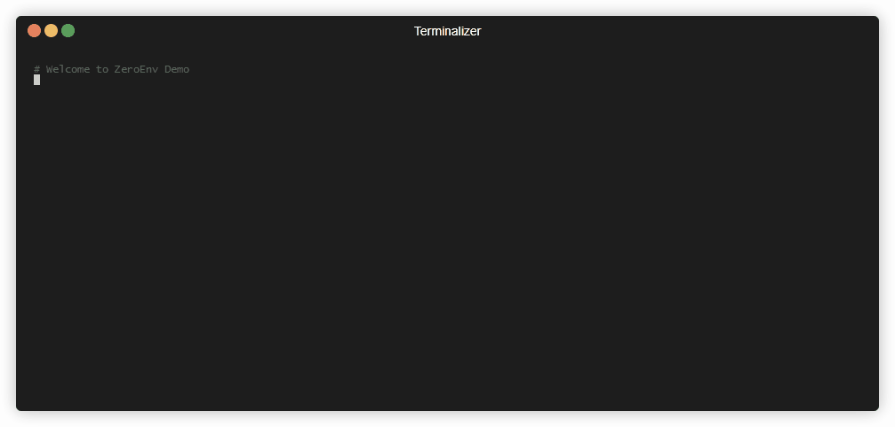

<h1 align="center">
  <br>
  
</h1>

<h4 align="center">Simple, secure, and git-safe secrets management.</h4>

<p align="center">
  <a href="https://pypi.org/project/zeroenv/">
    
  </a>
  <a href="https://github.com/ropeadope62/zeroenv/blob/main/LICENSE">
    
  </a>
  <a href="https://www.python.org/downloads/">
    
  </a>
  <a href="https://github.com/ropeadope62/zeroenv/actions/workflows/tests.yml">
    
  </a>
</p>

<p align="center">
  <a href="#features">Features</a> •
  <a href="#installation">Installation</a> •
  <a href="#usage">Usage</a> •
  <a href="#how-it-works">How It Works</a> •
  <a href="#team-workflow">Team Workflow</a> •
  <a href="#containerization--docker">Docker</a> •
  <a href="#testing">Testing</a> •
  <a href="#security">Security</a> •
  <a href="#command-reference">Command Reference</a>
</p>



## Features

* AES-256-GCM encryption with unique nonces
* Git-safe encrypted storage (commit `.secrets`, not keys)
* Zero-config initialization
* No code changes required (injects env vars)
* No infrastructure dependencies
* Cross-platform (Windows, macOS, Linux)
* Export to `.env` format

## Installation

```bash
pip install zeroenv
```

From source:
```bash
git clone https://github.com/ropeadope62/zeroenv
cd zeroenv
pip install -e .
```

## Usage

### Initialize

```bash
zeroenv init                    # Standard tier (fast, development)
zeroenv init --tier enhanced    # Enhanced security (100k iterations)
zeroenv init --tier max         # Maximum security (500k iterations, production)
```

Creates `.secrets` (encrypted) and `.secrets.key` (master key). Automatically updates `.gitignore`.

**Security Tiers:**
- **Standard**: Direct key usage, fastest performance (development)
- **Enhanced**: PBKDF2-SHA256 with 100k iterations (balanced security/performance)
- **Max**: PBKDF2-SHA256 with 500k iterations (production environments)

### Add Secrets

```bash
zeroenv add DATABASE_URL "postgresql://localhost/mydb"
zeroenv add API_KEY "sk_test_1234567890"
```

### Run Commands

```bash
zeroenv run python app.py
zeroenv run npm start
zeroenv run dotnet run
```

Secrets are injected as environment variables. Your code remains unchanged:

```python
import os
api_key = os.getenv('API_KEY')
```

### List Secrets

```bash
zeroenv ls              # Names only
zeroenv ls --values     # Show values
```

### Get Secret

```bash
zeroenv get API_KEY
```

### Export

```bash
zeroenv export          # .env format
zeroenv export > .env   # Save to file
zeroenv export -f json  # JSON format
```

### Remove Secret

```bash
zeroenv rm SECRET_NAME
```

### View Configuration

```bash
zeroenv info
```

Displays:
- Security tier and description
- PBKDF2 iteration count
- Encryption algorithm (AES-256-GCM)
- Number of secrets stored
- File locations

## How It Works

### Two-File System

**`.secrets`** - Encrypted secrets (safe to commit)
```json
{
  "version": "1.0",
  "security_tier": "enhanced",
  "salt": "xY9zA1bC2dE3fG4h...",
  "secrets": {
    "API_KEY": {
      "ciphertext": "aB3dE5fG7hI9jK1...",
      "nonce": "pQ6rS8tU0vW1xY2z..."
    }
  }
}
```

**`.secrets.key`** - Master key (never commit, auto-gitignored)
```
aB3dE5fG7hI9jK1lM2nO4pQ6rS8tU0vW1xY2zA3bC4dE5f=
```

### Encryption

- **Algorithm:** AES-256-GCM
- **Key size:** 256 bits
- **Nonce size:** 96 bits (unique per secret)
- **Authenticated encryption:** Tamper-proof
- **Key derivation:** PBKDF2-HMAC-SHA256 (enhanced/max tiers)
- **KDF iterations:** 100k (enhanced) or 500k (max)

The encryption process varies by security tier:
- **Standard:** Master key → AES-256-GCM encryption
- **Enhanced/Max:** Master key + salt → PBKDF2 → Derived key → AES-256-GCM encryption

## Team Usage

While ZeroEnv was designed with individual developers in mind, usage in small teams can be achieved by sharing the master key. 

### Setup

```bash
# Developer 1
zeroenv init
zeroenv add API_KEY "shared-key"
git add .secrets .gitignore
git commit -m "Add encrypted secrets"
git push
```

### Join Team

```bash
# Developer 2
git clone repo
cd repo
echo "MASTER_KEY" > .secrets.key  # Received via secure channel
zeroenv ls  # Verify
```

Encrypted `.secrets` syncs via git. Master key shared once through secure channel (password manager, encrypted messaging).

## CI/CD

Set `ZEROENV_MASTER_KEY` environment variable:

### GitHub Actions
```yaml
- run: zeroenv run pytest
  env:
    ZEROENV_MASTER_KEY: ${{ secrets.ZEROENV_MASTER_KEY }}
```

### GitLab CI
```yaml
test:
  script:
    - zeroenv run pytest
```

### Azure Pipelines

```yaml
- script: zeroenv run pytest
  env:
    ZEROENV_MASTER_KEY: $(ZEROENV_MASTER_KEY)
```
## Containerization / Docker

ZeroEnv works seamlessly with Docker. You can inject secrets into your container at runtime without baking them into the image.

### Dockerfile

Install `zeroenv` in your image:

```dockerfile
FROM python:3.9-slim

WORKDIR /app
COPY . .
RUN pip install zeroenv
RUN pip install -r requirements.txt

# Don't set entrypoint here if you want to use zeroenv at runtime
CMD ["python", "app.py"]
```

### Docker Compose

Mount the `.secrets` file and the master key (via environment variable):

```yaml
version: '3'
services:
  web:
    build: .
    volumes:
      - ./.secrets:/app/.secrets:ro  # Mount secrets file read-only
    environment:
      - ZEROENV_MASTER_KEY=${ZEROENV_MASTER_KEY}  # Pass key from host
    command: zeroenv run python app.py
```

### Running with Docker

1. Export the master key on your host:
   ```bash
   export ZEROENV_MASTER_KEY=$(cat .secrets.key)
   ```

2. Run the container:
   ```bash
   docker-compose up
   ```
```

## Examples

### Basic Usage

```bash
# Initialize with enhanced security
zeroenv init --tier enhanced

# Check configuration
zeroenv info
# Output:
# ╭─────────────── ZeroEnv Configuration ───────────────╮
# │ Security Tier: Enhanced                             │
# │ PBKDF2 Iterations: 100,000 iterations               │
# │ Encryption: AES-256-GCM                             │
# │ Secrets Stored: 0                                   │
# ╰─────────────────────────────────────────────────────╯

# Add secrets
zeroenv add API_KEY "sk_test_1234"
zeroenv add DATABASE_URL "postgresql://localhost/db"

# Verify
zeroenv ls --values
```

### Django
```bash
zeroenv init
zeroenv add SECRET_KEY "django-key"
zeroenv add DATABASE_URL "postgresql://..."
zeroenv run python manage.py runserver
```

### Node.js
```bash
zeroenv init
zeroenv add PORT "3000"
zeroenv add MONGODB_URI "mongodb://..."
zeroenv run npm start
```

### .NET
```bash
zeroenv init
zeroenv add ConnectionStrings__Default "Server=..."
zeroenv run dotnet run
```

## Security

### Encryption Details

- **Algorithm:** AES-256-GCM (AEAD)
- **Key derivation:** 256-bit random key via `os.urandom()`
- **Nonce generation:** 96-bit random nonce per encryption
- **Library:** Python `cryptography` package

### Security Tiers

ZeroEnv offers three security tiers to balance performance and security:

#### Standard (Default)
- **Iterations:** 0 (direct key usage)
- **Performance:** Fastest
- **Use case:** Development, local testing
- **Security:** Strong encryption with AES-256-GCM

```bash
zeroenv init  # or explicitly: zeroenv init --tier standard
```

#### Enhanced
- **Iterations:** 100,000 (PBKDF2-HMAC-SHA256)
- **Performance:** Moderate (~100ms key derivation)
- **Use case:** Shared projects, small teams
- **Security:** Resistant to brute-force attacks on weak keys

```bash
zeroenv init --tier enhanced
```

#### Max
- **Iterations:** 500,000 (PBKDF2-HMAC-SHA256)
- **Performance:** Slower (~500ms key derivation)
- **Use case:** Production environments, sensitive data
- **Security:** Maximum protection against brute-force attacks

```bash
zeroenv init --tier max
```

**Note:** Security tier is set during initialization and stored in `.secrets`. All subsequent operations (add, get, run, export) automatically use the configured tier. Existing secrets files without a tier default to `standard` for backward compatibility.
- **Nonce generation:** 96-bit random nonce per encryption
- **Library:** Python `cryptography` package

## Command Reference

| Command | Description |
|---------|-------------|
| `init [--tier TIER]` | Initialize ZeroEnv in project (standard/enhanced/max) |
| `add NAME [VALUE]` | Add or update secret |
| `get NAME` | Retrieve secret value |
| `ls [--values]` | List secrets |
| `rm NAME` | Remove secret |
| `run COMMAND` | Run command with secrets |
| `export [-f FORMAT]` | Export secrets |
| `info` | Display security tier and configuration |

## Dependencies

- Python 3.10+
- `click` - CLI framework
- `rich` - Terminal formatting
- `cryptography` - AES-256-GCM implementation

## Testing

This directory contains comprehensive unit tests to ensure reliability and security.

## Why Testing is Critical

I have added some unit tests to validate the core functionality of ZeroEnv, including the cryptography and storage, Data Integrity, CLI Reliability, Edge Case Handling, Regression Prevention, and Cross-Platform Compatibility.

## Prerequisites

The tests require `pytest` and `click`. You can install the development dependencies with:

```bash
pip install pytest click cryptography rich
```

## Running Tests

To run all tests, execute the following command from the project root:

```bash
python -m pytest tests
```

To run tests with verbose output:

```bash
python -m pytest tests -v
```

To run with coverage report:

```bash
python -m pytest tests --cov=zeroenv --cov-report=html
```

## Test Structure

### `test_crypto.py` - Cryptographic Operations
Tests the core security layer:
- **Key Generation**: Validates 256-bit keys are properly generated
- **Encryption**: Ensures plaintext is encrypted correctly with unique nonces
- **Decryption**: Verifies encrypted data can be decrypted back to original
- **Key Encoding**: Tests base64 encoding/decoding of keys
- **Invalid Inputs**: Tests behavior with malformed data or wrong keys
- **Nonce Uniqueness**: Ensures each encryption uses a unique nonce

**Critical Tests:**
- Different values produce different ciphertexts
- Same value encrypted twice produces different ciphertexts (due to unique nonces)
- Decryption with wrong key fails properly
- Tampered ciphertext is detected

### `test_storage.py` - File Operations & Data Management
Tests the persistence layer:
- **Initialization**: Creates `.secrets` and `.secrets.key` files correctly
- **File Integrity**: Validates JSON structure and metadata
- **Secret CRUD**: Add, retrieve, update, delete secrets
- **Key Loading**: Properly loads master key from file
- **Error Handling**: Missing files, corrupted data, permission errors
- **Metadata**: Timestamps and versioning work correctly

**Critical Tests:**
- Secrets persist across program restarts
- Multiple secrets don't interfere with each other
- File permissions are appropriate
- Corrupted `.secrets` file is handled gracefully

### `test_cli.py` - Command Line Interface
Tests the user-facing commands:
- **Init Command**: Creates files and updates .gitignore
- **Add Command**: Interactive and direct modes work
- **Get Command**: Retrieves secrets correctly
- **List Command**: Shows secrets with/without values
- **Remove Command**: Deletes secrets with confirmation
- **Run Command**: Injects environment variables properly
- **Export Command**: Outputs in .env and JSON formats
- **Error Messages**: Helpful errors for common mistakes

**Critical Tests:**
- `zeroenv init` in already-initialized directory fails gracefully
- `zeroenv add` without init shows helpful error
- Environment variables are properly injected for `run`
- Confirmation prompts work for destructive operations
- Exit codes are correct (0 for success, 1 for errors)

## Troubleshooting

If you encounter issues with `test_cli.py` failing to capture output, ensure you are running the tests from the project root directory.

**Common Issues:**
- **Import errors**: Run `pip install -e .` from project root
- **File permission errors**: Tests create temporary directories - ensure write permissions
- **Flaky tests**: Some CLI tests may be environment-dependent - use `pytest-xdist` for isolation


## Development

```bash
git clone https://github.com/ropeadope62/zeroenv
cd zeroenv
pip install -e ".[dev]"
pytest
```

## License

MIT

## Credits

Built by Dave C. (ropeadope62) 
[artoffailing.com](https://artoffailing.com)

---

> GitHub [@ropeadope62](https://github.com/ropeadope62)
